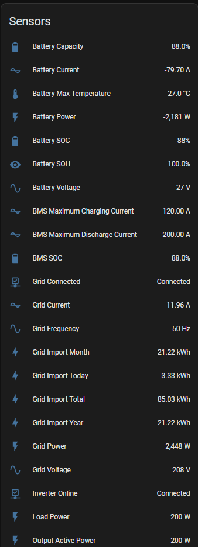
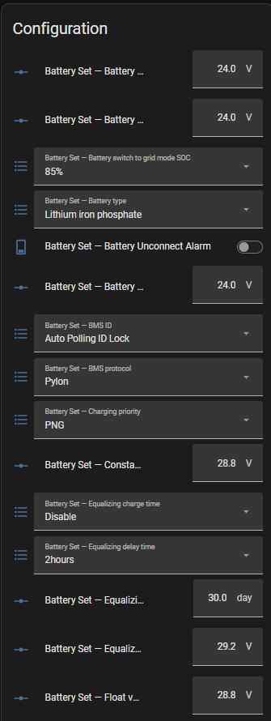
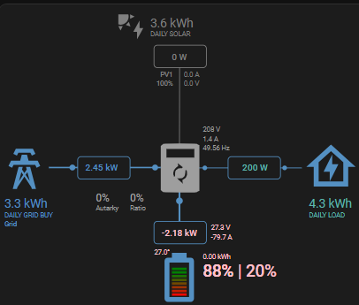

<div align="center">


# WattSeek for Home Assistant

Native cloud monitoring and protocol-driven inverter configuration for WattSeek systems.

[](https://my.home-assistant.io/redirect/hacs_repository/?owner=nazeehrai&repository=home-assistant-wattseek&category=integration)
[](https://my.home-assistant.io/redirect/config_flow_start/?domain=wattseek)

[](https://github.com/nazeehrai/home-assistant-wattseek/actions/workflows/validate.yml)
[](https://github.com/nazeehrai/home-assistant-wattseek/releases)
[](https://www.hacs.xyz/docs/faq/custom_repositories/)
[](LICENSE)
[](https://github.com/nazeehrai/home-assistant-wattseek/issues)

</div>

> [!IMPORTANT]
> WattSeek is an unofficial community integration and is not affiliated with WattSeek. It uses WattSeek's cloud service, so upstream API changes may affect functionality.

## Highlights

| Capability | What WattSeek provides |
|---|---|
| Account discovery | Lists available plants and lets you select an inverter explicitly |
| Safe device selection | Excludes datalogger/STICK devices from controllable inverter choices |
| Live telemetry | Grid, PV, load, battery, output, BMS, temperature and energy sensors |
| Protocol-driven controls | Builds labels, options, units, ranges and setting groups from WattSeek protocol JSON |
| Staged configuration | Edits remain local until the corresponding group is submitted |
| Portal-compatible commits | Sends the complete group, waits for `WRITE`, performs `READ`, then refreshes cloud values |
| Multiple installations | Stores the chosen plant and inverter in each Home Assistant config entry |
| Energy-card compatibility | Normalizes battery power to negative charging and positive discharging |

## Screenshots

<table>
  <tr>
    <td align="center"><strong>Live inverter telemetry</strong></td>
    <td align="center"><strong>Protocol-driven configuration</strong></td>
  </tr>
  <tr>
    <td></td>
    <td></td>
  </tr>
</table>

<p align="center">
  
</p>

## Installation

### HACS — recommended

1. Select **Open in HACS** above.
2. If prompted, add this repository as an **Integration** custom repository.
3. Select **Download** and choose the latest release.
4. Restart Home Assistant.
5. Select **Add WattSeek to Home Assistant** above, or go to **Settings → Devices & services → Add integration → WattSeek**.
6. Sign in with your WattSeek account, choose the plant and then choose the inverter.

HACS installations receive normal update notifications whenever a new GitHub release is published.

### Manual

1. Download the latest release from [GitHub Releases](https://github.com/nazeehrai/home-assistant-wattseek/releases).
2. Copy `custom_components/wattseek` into `/config/custom_components/wattseek`.
3. Restart Home Assistant.
4. Add **WattSeek** from **Settings → Devices & services**.

Manual installations do not receive HACS update notifications.

## How grouped settings work

The WattSeek portal organizes inverter configuration into sections such as **System Set**, **Battery Set**, **Line Set**, **Output Set**, and **Protection Set**. This integration preserves that model.

1. Change one or more entities belonging to a settings group.
2. Home Assistant stages those values; the inverter remains unchanged.
3. The group's **Pending changes** sensor turns on and its **Submit** button becomes available.
4. Press **Submit** to send the complete group atomically.
5. The integration waits for WattSeek's `WRITE`, issues the matching inverter-facing `READ`, refreshes protocol values, and clears the draft.

This prevents partial group updates and mirrors the behavior of WattSeek's **Set up** action.

> [!CAUTION]
> Inverter settings can affect battery life, grid behavior, output availability and connected loads. Verify the manufacturer's limits before submitting changes. High-risk controls such as factory reset and remote-control commands are disabled by default where they can be identified.

## Entities

### Monitoring

- Grid power, voltage, current, frequency and imported energy
- PV power, voltage, current and generated energy
- Load and output power, voltage, current, frequency and apparent power
- Battery power, voltage, current, SOC, SOH and temperature
- BMS SOC and charge/discharge current limits
- Inverter-online and grid-connected status

### Configuration

- `SELECT` protocol commands become Home Assistant selects.
- Numeric `INPUT` commands become number entities with protocol-derived limits and precision.
- Two-state `ON/OFF` or `Enable/Disable` commands become switches.
- Every WattSeek group receives a pending-change sensor and Submit button.

## Battery direction

WattSeek reports battery power as a magnitude while battery current supplies direction. The integration normalizes the result for common Home Assistant energy-flow consumers:

- **Negative:** charging
- **Positive:** discharging
- **Zero:** idle, using a small current deadband to prevent direction flicker

This convention works directly with the [Sunsynk Power Flow Card](https://slipx06.github.io/sunsynk-power-flow-card/configuration.html) without dashboard-side inversion.

## Polling

The default interval is 30 seconds and can be changed between 10 and 300 seconds from **Settings → Devices & services → WattSeek → Configure**.

## Troubleshooting

### Settings changed in HA but not on the inverter

This is expected until the corresponding group **Submit** button is pressed.

### Submit is unavailable

The button becomes available only when its group contains staged changes.

### Values briefly appear cached

Submission includes WattSeek's group `READ` operation and refreshes the command-value cache after the inverter responds.

### Integration does not appear after installation

Restart Home Assistant and refresh the browser. Confirm that this directory exists:

```text
/config/custom_components/wattseek
```

### Getting support

Open a [bug report](https://github.com/nazeehrai/home-assistant-wattseek/issues/new?template=bug_report.yml) and attach Home Assistant diagnostics and relevant redacted logs. Never publish your WattSeek password, authentication token, email address, plant address, device ID or full serial number.

## Contributing

Feature requests and pull requests are welcome. Protocol captures from additional inverter models are useful, but must be scrubbed of credentials and personal or device-identifying information before submission.

## License

Released under the [MIT License](LICENSE).

